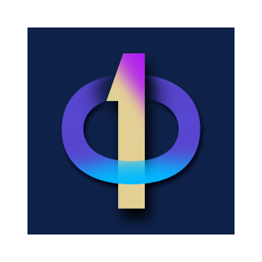

<div align="center">
  <h1>🔢 Calcitron Number System Converter</h1>
  <h3>Seamlessly Convert Between Decimal, Binary, Octal, and Hexadecimal</h3>
  
  [](https://play.google.com/store/apps/details?id=com.calcitron.converter)
  [](LICENSE)
  []()
  
  
</div>

## 🌟 Overview
Calcitron is a powerful yet simple number system converter that helps students, developers, and professionals convert between decimal, binary, octal, and hexadecimal number systems with detailed, step-by-step explanations. Perfect for learning and verifying your number system conversions!

## 🚀 Key Features

### 🔢 Number System Conversion
- **Decimal ↔ Binary**: Convert between base-10 and base-2 systems
- **Decimal ↔ Octal**: Convert between base-10 and base-8 systems
- **Decimal ↔ Hexadecimal**: Convert between base-10 and base-16 systems
- **Binary ↔ Octal/Hexadecimal**: Direct conversion between different bases
- **Step-by-Step Solutions**: Detailed explanations for every conversion

### 📝 Conversion Methods
- **Integer Conversions**: 
  - Division-Remainder Method
  - Power of 2/8/16 Method
  - Direct Substitution
- **Fractional Conversions**:
  - Multiplication Method
  - Successive Division Method
- **Two's Complement**: For negative number representation

### 🎓 Learning Tools
- **Interactive Tutorials**: Learn number system concepts
- **Practice Mode**: Test your conversion skills
- **History**: Review your past conversions
- **Favorites**: Save frequently used conversions

### ⚡ Advanced Features
- **Bitwise Operations**: AND, OR, XOR, NOT, Shift operations
- **Number Formatting**: Group digits for better readability
- **Copy to Clipboard**: One-tap copy of results
- **Dark/Light Theme**: Choose your preferred interface style

## 📱 Android Installation

### Google Play Store (Recommended)
1. Open the [Google Play Store](https://play.google.com/store/apps/details?id=com.calcitron.converter) on your Android device
2. Search for "Calcitron ELE Converter"
3. Tap "Install"
4. Once installed, open the app and sign in or create an account

### Manual APK Installation
1. [Download the latest APK](https://github.com/Anant-4-code/Calcitron-Digital-ELE-Converter/releases/latest)
2. On your Android device, go to Settings > Security
3. Enable "Unknown sources" (if not already enabled)
4. Open the downloaded APK file
5. Tap "Install" and follow the on-screen instructions

## 🔢 Conversion Examples

### 1. Decimal to Binary Conversion
**Example:** Convert 29 to binary

**Step 1:** Divide by 2 and record remainders
```
29 ÷ 2 = 14 remainder 1
14 ÷ 2 = 7  remainder 0
7  ÷ 2 = 3  remainder 1
3  ÷ 2 = 1  remainder 1
1  ÷ 2 = 0  remainder 1
```
**Step 2:** Write remainders in reverse order
**Result:** 29₁₀ = 11101₂

### 2. Binary to Hexadecimal
**Example:** Convert 11010110 to hexadecimal

**Step 1:** Group into 4 bits (add leading zeros if needed)
`1101 0110`

**Step 2:** Convert each group
`1101` = D
`0110` = 6

**Result:** 11010110₂ = D6₁₆

### 3. Decimal to Octal
**Example:** Convert 143 to octal

**Step 1:** Divide by 8 and record remainders
```
143 ÷ 8 = 17 remainder 7
 17 ÷ 8 = 2  remainder 1
  2 ÷ 8 = 0  remainder 2
```
**Step 2:** Write remainders in reverse order
**Result:** 143₁₀ = 217₈


## 🏗️ Project Structure
```
CalcitronAi/
├── app/
│   ├── src/
│   │   ├── main/
│   │   │   ├── java/com/calcitron/
│   │   │   │   ├── activities/    # App screens
│   │   │   │   ├── adapters/      # RecyclerView adapters
│   │   │   │   ├── models/        # Data models
│   │   │   │   ├── utils/         # Utility classes
│   │   │   │   └── MainActivity.kt
│   │   │   ├── res/               # Resources
│   │   │   │   ├── drawable/      # Images and icons
│   │   │   │   ├── layout/        # XML layouts
│   │   │   │   └── values/        # Strings, colors, styles
│   │   │   └── AndroidManifest.xml
│   │   └── test/                 # Unit tests
│   └── build.gradle              # App level build config
├── build.gradle                  # Project level build config
└── settings.gradle              # Project settings
```

## 🎬 How to Use

### Basic Conversion
1. **Launch** the app and sign in
2. Tap the ➕ button to add files
3. Select your desired **output format**
4. Choose any conversion options
5. Tap **Convert** and wait for the process to complete
6. Access your files in the **Downloads** section

### Advanced Features
- **Batch Processing**: Select multiple files and convert them at once
- **Cloud Storage**: Connect your cloud accounts for easy file access
- **Templates**: Save frequently used settings as templates
- **History**: View and manage your conversion history

## 🛠️ System Requirements
- **Android 8.0 (API 26) or higher**
- **Minimum 2GB RAM** (4GB recommended)
- **100MB free storage** (for app installation)
- **Internet connection** (for cloud features and updates)

## 👥 Join Our Community

### 🤝 Contributing
✨ We're thrilled you want to contribute! Here's how you can help make Calcitron even better:

1. 🍴 **Fork** the repository
2. 🌿 Create a feature branch: `git checkout -b feature/amazing-feature`
3. 💾 Commit your changes: `git commit -m '✨ Add amazing feature'`
4. 🚀 Push to the branch: `git push origin feature/amazing-feature`
5. 🔄 Open a **Pull Request**

📘 Check out our [Contributing Guidelines](CONTRIBUTING.md) for more details on how we work together!

---

## 📚 Documentation Hub

### 📖 User Guides
- [📱 Getting Started](docs/GETTING_STARTED.md) - Your first steps with Calcitron
- [🎯 Features Guide](docs/FEATURES.md) - Explore all features in detail
- [🎥 Video Tutorials](https://youtube.com/calcitron) - Watch and learn

### 👨‍💻 Developer Resources
- [⚙️ Setup Guide](docs/DEVELOPER_SETUP.md) - Get your dev environment ready
- [🏗️ Architecture](docs/ARCHITECTURE.md) - Understand the codebase
- [🧪 Testing](docs/TESTING.md) - How we ensure quality
- [📡 API Reference](docs/API.md) - Integration guide

### 🛠️ Troubleshooting
- [🔍 Common Issues](docs/TROUBLESHOOTING.md) - Quick fixes for common problems
- [📝 Changelog](CHANGELOG.md) - See what's new in each version
- [🚀 Upgrade Guide](docs/UPGRADE.md) - Update your app smoothly

---

## 💬 Need Help? We've Got You Covered!

### 🆘 Support Channels
- 📖 [Frequently Asked Questions](docs/FAQ.md) - Quick answers to common questions
- 🐞 [Report a Bug](https://github.com/Anant-4-code/Calcitron-Digital-ELE-Converter/issues) - Found an issue? Let us know!
- 💡 [Request a Feature](https://github.com/Anant-4-code/Calcitron-Digital-ELE-Converter/discussions) - Have an idea? We'd love to hear it!

### 🌐 Connect With Us
- 💬 [Join our Discord](https://discord.gg/calcitron) - Chat with the community
- 🐦 [Follow on Twitter](https://twitter.com/calcitronapp) - Stay updated
- ✉️ [Email Support](mailto:support@calcitron.app) - Get direct help

### 📢 Stay in the Loop
- 📰 [Blog](https://blog.calcitron.app) - Latest news and updates
- 📆 [Roadmap](https://github.com/Anant-4-code/Calcitron-Digital-ELE-Converter/projects/1) - See what's coming next
- 🌟 [Showcase](https://github.com/Anant-4-code/Calcitron-Digital-ELE-Converter/discussions/categories/show-and-tell) - Share what you've built

## 📚 Learning Resources

### Number System Basics
- **Decimal (Base-10)**: The standard number system using digits 0-9
- **Binary (Base-2)**: Uses only 0 and 1, fundamental in computing
- **Octal (Base-8)**: Uses digits 0-7, useful in computing
- **Hexadecimal (Base-16)**: Uses 0-9 and A-F, widely used in programming

### Common Use Cases
- **Computer Science**: Memory addressing, color codes, permissions
- **Electronics**: Digital circuits, bitwise operations
- **Networking**: IP addressing, subnet masks
- **Programming**: Bit manipulation, memory optimization

## 📄 License
This project is licensed under the MIT License - see the [LICENSE](LICENSE) file for details.

## ✨ Acknowledgments

### Core Team
- **Anant** - Project Lead & Developer
- **Mathematics Educators** - For guidance on teaching methods
- **Beta Testers** - For valuable feedback and bug reports

### Technologies Used
- [Kotlin](https://kotlinlang.org/) - Primary programming language
- [Android Jetpack Compose](https://developer.android.com/jetpack/compose) - Modern UI toolkit
- [Kotlin Coroutines](https://kotlinlang.org/docs/coroutines-overview.html) - For asynchronous operations
- [Material Design 3](https://m3.material.io/) - For beautiful, consistent UI

### Special Thanks
- Computer Science educators worldwide
- The Kotlin and Android developer communities
- All our users for their support and feedback

---

<div align="center">
  Made with ❤️ by the Calcitron Team | Happy Converting! 🚀
</div>
